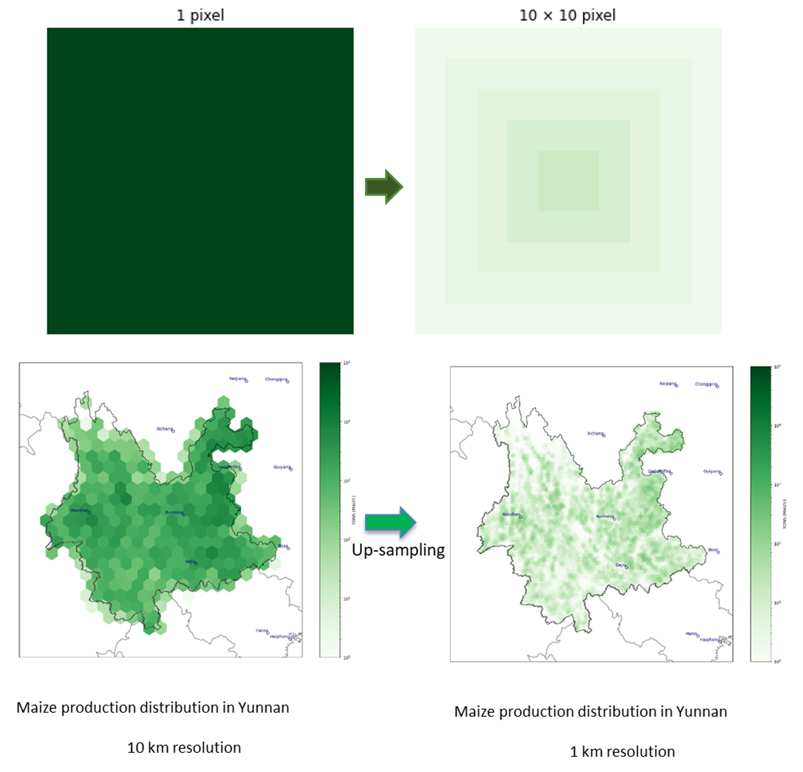

# SPAM-China-1km-Production

## Overview
This project generates the distribution of crop production at the provincial level in China from 2010 to 2022. It currently covers 17 types of crops, with plans to expand in the future. The final output provides detailed crop distribution based on various irrigation technologies. You can check the detailed script through [github](https://github.com/wri-china/data-sharing/blob/main/SPAM-China-1km) 
we offer 2020 all 31 provincial level wheat production under all technologies, download [here](https://china-data-team-bucket-public.s3.cn-northwest-1.amazonaws.com.cn/SPAM_crops/result/Prod_2020.7z)

## Key Features
- **Historical Data Analysis:** Covers crop distribution data from 2010 to 2022.
- **Multiple Crop Types:** Supports 17 different crop types, with plans to add more.
- **Irrigation Technology Impact:** Analyzes crop production based on different irrigation technologies.

## Methodology
we combine SPAM with production values from the National Bureau of Statistics to generate the wanted production distribution.
There are 2 steps containing in the methodology:
1. Upsampling: The original crop production dataset's spatial resolution is around 10km, we used bilinear interpolation to upsample the dataset, increasing the spatial resolution from 10km to 1km. This interpolation method ensures that the total production is consistent with the official statistics, and the value of each pixel at the original resolution  is the same as the total value within the range of the original pixel resolution after scaling. However, since it is scaled based on a mathematical algorithm and does not take into account the actual distribution of crop production at a 1km resolution, there is a discrepancy between the scaled results and the actual observations.

2. Calibration: For crop production from 2011 to 2020, we used the 2010 crop production distribution in Yunnan as a baseline and scaled the corresponding crop production data from 2010 to 2020, based on data from the [National Bureau of Statistics](https://data.stats.gov.cn/easyquery.htm?cn=C01). 
	The specific formulas are as follows:

	\right)}{S_{um}(C_{lip}(SPAM_{2010}))})

	

		Interpolation: it refers to up-sampling from 10km resolution to 1km resolution

		Clip: it refers to clipping the area of Yunnan from the origin SPAM data by using Yunnan province’s boundary 

		Sum: it refers to the accumulation of all the pixel values in SPAM 2010 in the region of Yunnan

		NBS{Year}: it refers to the total agriculture production in Yunnan for the year {Year} according to the standards of the National Bureau of Statistics.

For the different technologies's productions, we first calculate the ratio of 2010, and we use this ratio to map the results of the future years

## Usage Instructions
1. **Configuration with `InitialConfig.py`:**
   - This module helps you generate the `config.ini` file.
   - You should change the directory based on what you need. 
   - After you modify the directory, crop type, province, year and run `InitialConfig.py`, you will get the required `config.ini`  

2. **Run `SPAMChina.py`:**
   - with target `config.ini`, you can run `SPAMChina.py`. you will get all target crops in the target province during the target year under six types of irrigation techniques

## Directory Structure
- `excel`: Folder to store Excel files. you can change through "dir_prodxls": "./excel/" in `InitialConfig.py`
- `out`: Output folder for results. You can change through  "dir_output": "./out/" in `InitialConfig.py`
- `shp`: Contains `SPAMChina1km` shapefiles for clipping study area. you can change through  "dir_provshp": "./shp/" in `InitialConfig.py`
- `data`: Contains `SPAM` data, you can download from .you can change through  "dir_prodtif": "./data/spam2010v2r0_global_prod.geotiff/" in `InitialConfig.py`, you can download SPAM origin dataset from [AWS link](https://china-data-team-bucket-public.s3.cn-northwest-1.amazonaws.com.cn/SPAM_crops/data/spam2010v2r0_global_prod.geotiff.zip), you can download first, and unzip the file into ./data/

## Crop Types and Technologies
The script categorizes crop production based on different technologies:
- `*_A`: All technologies together (complete crop).
- `*_I`: Irrigated portion of the crop.
- `*_H`: Rainfed high inputs portion of the crop.
- `*_L`: Rainfed low inputs portion of the crop.
- `*_S`: Rainfed subsistence portion of the crop.
- `*_R`: Rainfed portion of the crop (equals `A - I`, or `H + L + S`).
